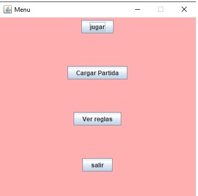
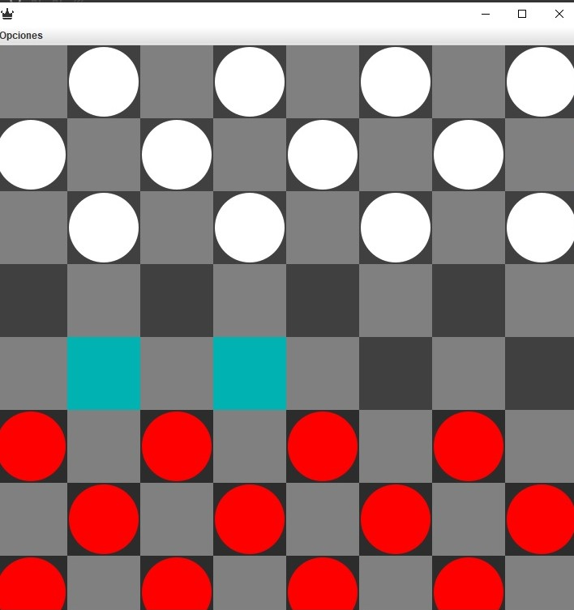
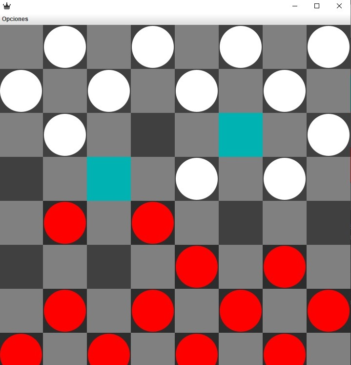
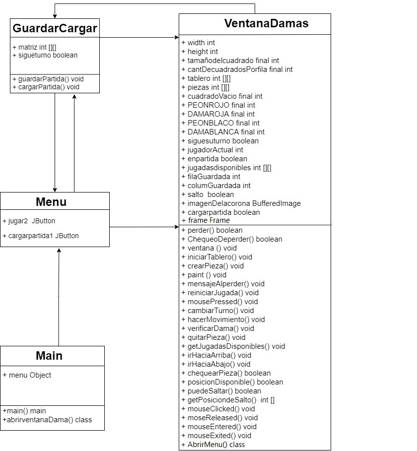

# Damas
**Pasos para ejecutar el Juego**
* Para comenzar la partida tenes que hacer click en "Jugar".\
* Para cargar una partida (primero hay que guardar una partida para poder
jugar una partida guardada, la opcion guardar se muestra cuando haces 
click en jugar).\
* Ver reglas ayuda a saber como jugar a las damas.\
* la opcion sair termina el programa, es decir cierra el juego.

**Instrucciones para jugar a las Damas**\
Comienzan las rojas, para hacer un movimiento hay que hacer click en la pieza
(peon o Dama) y te mostrara los posibles movimientos que tiene esa pieza.

Y si deseas mover esa pieza haces click en los espacios marcados, sino podes hacer click
en otra pieza para ver lo posibles movimientos que tiene. Para comer una pieza enemiga 
es el mismo caso

**Diagrama de Clases del juego**

